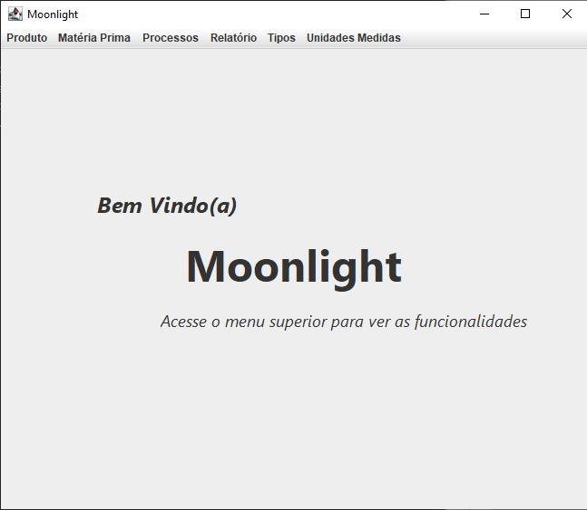
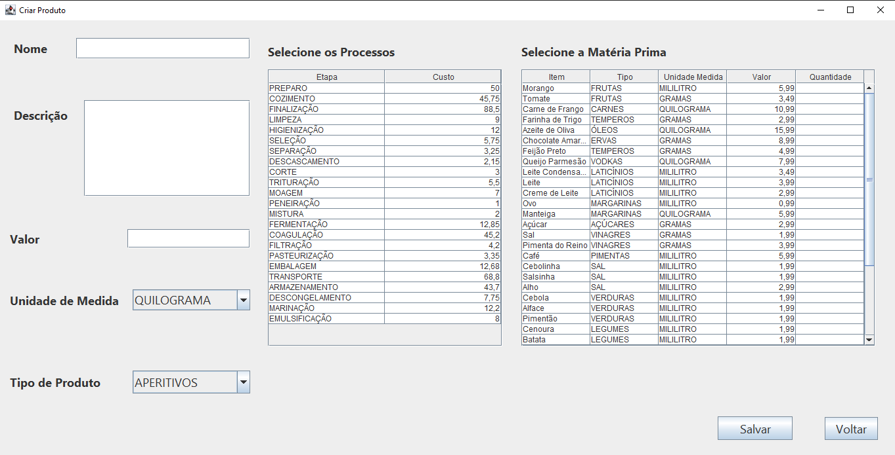
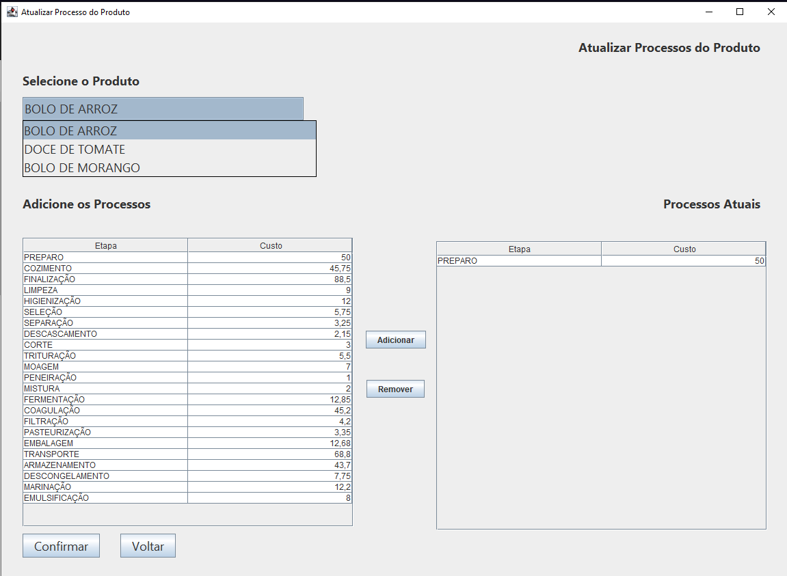
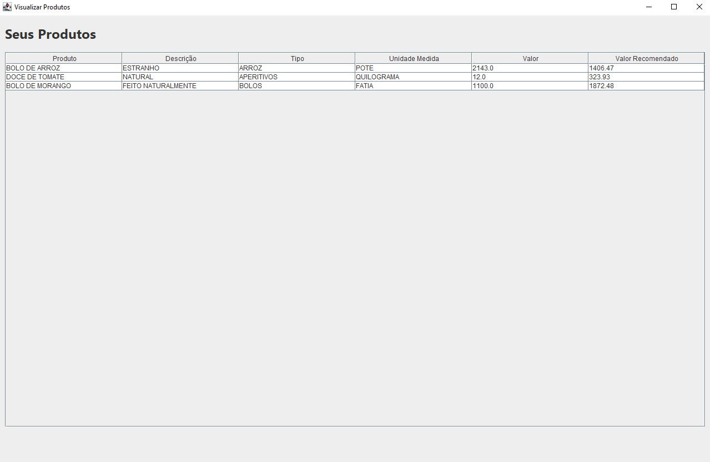
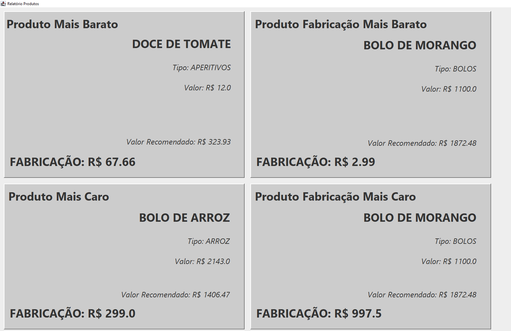

# Moonlight

O sistema de gerenciamento de custos tem como objetivo auxiliar os microempreendedores a calcularem e terem melhor rendimento sobre o lucro de seus produtos, se baseando no custo industrial de fabricação.

## Objetivos

- Permitir o cadastro de produtos a serem vendidos. Exemplo: Brigadeiro, bolo, milkshake.
- Apresentar uma melhor percepção do custo dos produtos a serem produzidos, auxiliando ao saber o valor recomendado a ser vendido.
- Permitir o cadastro de matéria prima, o item necessário a ser utilizado para produzir o produto. Exemplo: Tomate, banana, leite, açúcar.
- Permitir o cadastro de processos necessários para a fabricação de produtos.

## Autores

- [@Victor Santos](https://www.github.com/victorsantos09)
- [@Pedro Janke](https://github.com/pedrojanke)
- [@Amanda Hirata](https://github.com/Amahitsu)
- [@Gustavo Schwartz](https://github.com/gustavohschwartz)

## Funcionalidades

- Gerenciamento do Produto.
- Gerenciamento de Matéria-Prima.
- Gerenciamento de Processos.
- Calcular Valor Recomendado de Venda.
- Calcular Custo Industrial.

## Screenshots

Tela Inicial

Criar Produto

Atualizar Processos

Visualizar Produtos

Relatório

## Stack utilizada

**Front-end:** Java JFrame.

**Back-end:** Java Maeven, MySQL.
